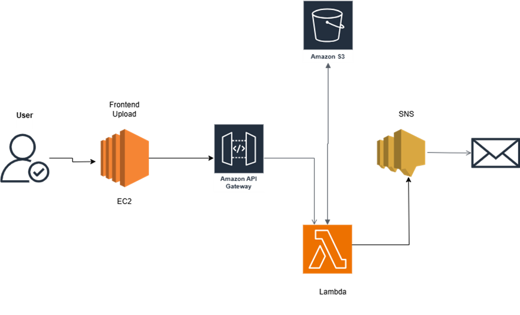

<h1>DataNotify: Empowering Data Automation with S3, Lambda, SNS, API Gateway, and EC2</h1>
<h3>Project Overview</h3>

DataNotify expands its capabilities by integrating Amazon API Gateway to facilitate secure and efficient communication between the frontend application and backend services. This project leverages AWS S3 for data storage, AWS Lambda for data processing, Amazon SNS for notifications, an EC2 instance with Apache2 for hosting the frontend, and API Gateway for managing API requests and responses. The solution ensures seamless data handling, real-time notifications, and secure frontend-backend connectivity.

<h3>Project Structure</h3>

 
 
<h3>Key Components</h3>
1.	Amazon S3: Scalable storage service for storing uploaded data. 
2.	AWS Lambda: Serverless compute service for processing data. 
3.	Amazon SNS: Simple Notification Service for sending real-time notifications. 
4.	EC2 Instance with Apache2: Web server to host and serve the frontend application and handle data uploads. 
5.	Amazon API Gateway: Managed service for creating and managing RESTful APIs to connect the frontend and backend services. 
6.	IAM Roles: Permissions management to secure interactions between AWS services. 

<h3>Detailed Implementation</h3>

<h4>Step 1: Setting Up Amazon S3</h4>
1  Create an S3 Bucket:
o	Create a new S3 bucket (e.g., frontend-data-storage) for storing uploaded data.
2.	Configure Bucket Permissions:
o	Define bucket policies and access control to allow uploads from API Gateway and access from Lambda.
Step 2: Configuring AWS Lambda
1.	Create a Lambda Function:
o	Navigate to AWS Lambda in the AWS Management Console.
o	Create a new Lambda function (e.g., DataProcessingFunction) to process uploaded data.
o	Write function code in Python to handle data processing tasks.
2.	Assign IAM Role to Lambda:
o	Create an IAM role with policies:
	AmazonS3FullAccess or fine-tuned S3 permissions.
	AmazonSNSFullAccess or fine-tuned SNS publish permissions.
o	Attach this IAM role to the Lambda function to grant necessary permissions.
3.	Set Up S3 Trigger:
o	Configure Lambda function to trigger on S3 bucket events (e.g., ObjectCreated).
Step 3: Setting Up Amazon SNS
1.	Create an SNS Topic:
o	Navigate to Amazon SNS in the AWS Management Console.
o	Create a new SNS topic (e.g., DataUploadNotifications).
2.	Subscribe Users to SNS Topic:
o	Add subscribers (e.g., email addresses) to receive notifications from the SNS topic.
Step 4: EC2 Instance with Apache2
1.	Launch an EC2 Instance:
o	Launch an EC2 instance with Amazon Linux or Ubuntu.
o	Install and configure Apache2 to host and serve the frontend application.
2.	Integrate Frontend Application:
o	Develop or integrate the frontend application (e.g., HTML, JavaScript) to interact with API Gateway endpoints.
3.	Configure Apache2 for API Gateway:
o	Modify Apache2 settings to handle API requests and responses securely.
Step 5: Configuring Amazon API Gateway
1.	Create an API Gateway REST API:
o	Navigate to Amazon API Gateway in the AWS Management Console.
o	Create a new REST API (e.g., DataNotifyAPI) to manage frontend-backend communication.
2.	Define API Resources and Methods:
o	Define resources (e.g., /upload) and methods (e.g., POST) to handle data uploads from the frontend.
3.	Integrate with AWS Lambda:
o	Connect API Gateway methods to AWS Lambda functions (e.g., DataProcessingFunction) for data processing.
4.	Deploy the API:
o	Deploy the API to a stage (e.g., prod) to generate API Gateway endpoints for frontend access.

<h3>Project Workflow</h3>
<ul><b>Frontend Data Upload via API Gateway:</b>
<li>	Users interact with the frontend application hosted on an EC2 instance through API Gateway endpoints.<li>
<li>		API Gateway securely forwards data uploads to AWS Lambda for processing.<li>
2.	<b>Data Processing with Lambda:</b>
o	<li>	AWS Lambda processes the uploaded data based on predefined logic.<li>
o	<li>	Processed data triggers notifications through Amazon SNS.<li>
3.<b>	Real-Time Notifications:</b>
o	<li>	Amazon SNS sends notifications to subscribed users or systems about data upload and processing outcomes.<li>
</ul>

<h3>Benefits</h3>
•	Scalability: Easily scales to handle growing data volumes and fluctuating workloads. 
•	Cost-Efficiency: Pay only for the resources consumed with AWS Lambda’s serverless architecture. 
•	Reliability: Ensures high availability and durability with AWS's robust infrastructure. 
•	Real-Time Notifications: Instantly notifies users about data upload and processing outcomes. 
•	Security: Implements strong access controls and encryption mechanisms to protect data. 

